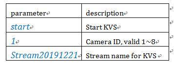

Run a simple python sample on Altek AIBox device running embedded Linux by Yocto
===
---

# Table of Contents

-   [Introduction](#Introduction)
-   [Step 1: Prerequisites](#Prerequisites)
-   [Step 2: Prepare your Device](#PrepareDevice)
-   [Step 3: Manual Test for AWS KVS](#Manual)
-   [Step 4: Next Steps](#NextSteps)


<a name="Introduction"></a>
# Introduction

**About this document**

This document describes how to connect Altek AIBox device running embedded Linux by Yocto with AWS GreenGrass and KVS support. 

<a name="Prerequisites"></a>
# Step 1: Prerequisites

Refer to below link to setup and add the permission for a new IAM user.
https://docs.aws.amazon.com/en_us/IAM/latest/UserGuide/getting-started_create-admin-group.html

Creating an Administrator IAM User and Group (Console)

<a name="PrepareDevice"></a>
# Step 2: Prepare your Device

This section will guide you to setup connection between IPCamera and AIBox. 

Before starting setup, you may refer to below LED indicator/ Button scenarios at AIBox
 

 

## What you will do for network configuration

<a name="2_1_Network_setup"></a>
### 2.1 Network setup for AIBox 

#### 2.1.1 Connect your AIBox with PC via Wi-Fi
At your PC side, please connect to a Wi-Fi network, named as altek_edgebox**** (**** is the last 4 characters of the device’s Wi-Fi MAC address, e.g. altek_edgebox9613). Then, you can follow step 1.1 or 1.2 to redirect AIBox network to Wi-Fi AP or Ethernet router. Password of AIBox AP is "12345678"


#### 2.1.2 Direct your AIBox to a Wi-Fi AP

Open web browser (e.g. Chrome) by link http://192.168.143.1/ to  AP setting webpage. 
Then, input SSID/Password for one internet-available Wi-Fi AP. AIBox nework will be redirected to your assigned Wi-Fi AP.

 

Once Wi-Fi connecting successfully, it will redirect to AIBOX IPC preview/config webpage (http://192.168.143.1:9080)


#### 2.1.3 Direct your AIBox to an ethernet router

If ethernet is connected to AIBOX already, open web browser (e.g. Chrome) by link http://192.168.143.1/, it will be redirected to login webpage automatically.

#### 2.1.4  Login for IPC preview/configure webpage

Please input Username/Password as "admin/admin“, then press "Login" to enter IPC preview/configure webpage.


<a name="2_1_5_ToSSH"></a>
 #### 2.1.5 Confirm network configuration by Linux shell over SSH
If you already complete above network settings, you can enter linux shell via SSH.
Information for SSH access will be below
-  IP of SoftAP at AIBox: 192.168.143.1
-  Account: root
-  Password: oelinux123

Terminal, like putty, will be available for ssh access

 

Once ssh is available, you can use "ifconfig" to check network configurations


<a name="2_2_ConfigIPCam_to_WifiAP"></a>
### 2.2 Connect your IPCamera to Wi-Fi AP or ethernet router.

You may prepare x1~x4 IPCameras, compatible with OnVIF + RTSP protocol. 
Please refer to user manual of IPCameras to setup your IPCamera, and direct your camera to to the same Wi-Fi AP or ethernet router as AIBox.

Following cameras are validated with AIBox for your reference.
- Sony: SNC-EB630
- Panasonic: WV-D3131L
- HIKVISION: DS-2CD1021FD-IW1, DS-2CD2042WD-I
- Dahua: HFW4233F-ZSA, HDW-4438C-A, HDW-4438C-A-V2
- Axis: M3007, M3045V
- Vivotek: CC8160

<a name="2_3_ConfigIPCam_via_WebUI"></a>
### 2.3 Config your IPCamera via Web UI
At IPC preview/configure webpage, all Onvif IPCs are scanned and listed. And you can press "Refresh“ to scan again.

 

You have to input username/password for Onvif IPCamera  to login. To simplify operating scenarios, all IPCameras’ account recommend be identical. Then, click camera link to start preview at web

 

<a name="2_4_ConfigDisplay_via_WebUI"></a>
 ### 2.4 Config your display out via Web UI
If you would like have start video analytic or HDMI display, you have to config your display out via Web UI


Click "Reflash" to scan avaialble IPCameras, then enable x1~x4 cameras as below

Remember to click "Save". After saving configuration, AIBox will reconnect cameras automatically while AIBox boot-up next time.


### 2.5 Reset your network configuration
Pinghole reset button as below. Network configuration will be reset


<a name="Manual"></a>
# Step 3: Manual Test for AWS KVS

This section walks you through the test to be performed on the IoT devices running the Linux operating system such that it can qualify for AWS KVS.

<a name="Step-3-1-AWS-KVS"></a>
## 3.1 AWS Kinesis Video Streams

Before starting KVS, ensure you have config your AIBox with one internet avaiable Wi-Fi AP, referring to [2.1](#2_1_Network_setup), and one IPCamera at least has been configed as well with AIBox, referring to [2.2](#2_2_ConfigIPCam_to_WifiAP) / [2.3](#2_3_ConfigIPCam_via_WebUI) / [2.4](#2_4_ConfigDisplay_via_WebUI)

### 3.1.1 Config and Start/Stop KVS
Login [AWS](https://aws.amazon.com/) first.

Then. at AWS Management Console, serach service "IAM", then select [user, whom you created]((#Prerequisites))

You can download and keep IAM access key as below


Refer to [2.1.5](#2_1_5_ToSSH), follow below steps to config your AIBox over ssh

- Enebale data flow to RTSP
```
setprop persist.fDataToRtsp.on 1
```
- Check your key for IAM by below cmd 
Then, comparing AWS_ACCESS_KEY_ID and AWS_SECRET_ACCESS_KEY, with your key 
```
cat /aws/amazon_kvs/aws_credential.json
```
- Please manually edit AWS_ACCESS_KEY_ID, AWS_SECRET_ACCESS_KEY, and AWS_DEFAULT_REGION over ssh as yours
```
vi /aws/amazon_kvs/aws_credential.json
```

- Reboot device to restart KVS
```
reboot -f
```

- You can start / stop KVS by below 2 cmds over ssh after rebooting. Supposedly, you can redirect one camera streaming to KVS
```
python aws/amazon_kvs/altek_kvsmgr.py start 1 stream20191024 &
```


```
python aws/amazon_kvs/altek_kvsmgr.py stop 1 &
```


### 3.1.2 Watch preview via KVS
- At AWS Management Console, serach and select service, "Kinesis Video Streams"
- Select stream, which you created. (ex. Stream20191024)


- Expand Media Player to view streaming


<a name="Step-3-2-AWS-IoT-Core"></a>
## 3.2 AWS IoT Core


To Be Updated


<a name="NextSteps"></a>
# Step 4: Next steps

You can move to [How to have AI model running at AIBox](./AI_Model_to_AIBox.md)